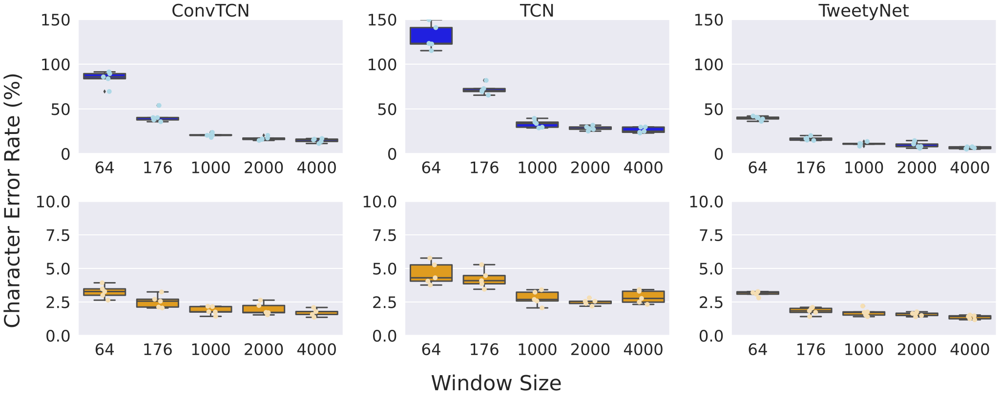

# Nicholson-Cohen-SfN-2023-poster

This is the code for a poster presented at the 2023 Society for Neuroscience meeting:
"Benchmarking neural network models for acoustic behavior with vak and VocalPy"

We compare two families of neural network models on the task of jointly segmenting and annotating animal sounds:


recurrent neural networks (RNNs), like [TweetyNet](https://elifesciences.org/articles/63853),
and temporal convolutional networks (TCNs) like [Deep Audio Segmenter (DAS)](https://elifesciences.org/articles/68837).


It is important to compare the two since TCNs can be substantially faster to train,
and depending on factors like input size, TCNs may be faster at inference time as well
(although the engineering of RNNs continues to evolve
and they can be much faster than models like Transformers for some tasks, see https://arxiv.org/abs/2303.06349).
Here we show results for simple "vanilla" TCNs
as originally described by [Bai et al 2018](https://arxiv.org/abs/1803.01271),
instead of the WaveNet-like architectures used by DAS and related work like [SELD-TCN](https://arxiv.org/abs/2003.01609).

We compare three different architectures:
* TweetyNet, an RNN with a front end that extracts features from spectrograms using trained 2-D convolutions, like those used by neural networks for image classification
* ConvTCN, which also has the exact same convolutional front end, but replaces the recurrent LSTM layer of TweetyNet with a "vanilla" TCN -- this architecture is simlar to SELD-TCN
* The same TCN *without* the convolutional front end, where we instead apply a [1x1 convolution](https://www.youtube.com/watch?v=c1RBQzKsDCk) across the frequency bins of the spectrogram to reduce dimensionality down to the number of channels in the TCN, in the same way that DAS does. (The ConvTCN applies this operation to the features extracted by the 2-D convolutional network.)


To compare these two families of models,
we use the neural network framework [vak](https://github.com/vocalpy/vakvocalpy) and a core package for acoustic communication research, [VocalPy](https://github.com/vocalpy/vocalpy),
along with a benchmark dataset of annotated song from four Bengalese finches, [BFSongRepo](https://nickledave.github.io/bfsongrepo/).

Our goal was to understand what factors matter in how we train these models,
and whether we can improve their performance.

## Our key findings

See [poster here](./doc/Nicholson-Cohen-SfN-2023.pdf).

### There's a direct relationship between the window size shown to the network during training and performance.

During training, all models are shown windows from spectrograms, drawn at random from a dataset.
We found that for all models, bigger windows gave better performance.
This is important, given that TweetyNet
used a window size of 176, while DAS used an effective window size of 64
(1024 audio samples that are fed through a trainable STFT to produce a spectrogram with 64 time bins).
Increasing the window size from 176 to 2000 resulted in an improvement in all metrics, for all models
(We show results for additional window sizes below).

We can see the effect of window size by looking at the frame error
and the character error rate:


Note that while the ConvTCN had the lowest frame error rate, the RNN had the lowest character error rate,
a key measure of how well the predicted sequences of labels match the ground truth sequences.

### Segmentation metrics suggest that temporal convolutional networks tend to oversegment

To understand this effect of window size and the difference in performance we saw between model types,
we computed [segmentaton metrics](https://vocalpy.readthedocs.io/en/latest/api/generated/vocalpy.metrics.segmentation.ir.html#module-vocalpy.metrics.segmentation.ir) using VocalPy.
We measured the precision and recall of the predicted segment boundaries,
with a tolerance of +/- 4 milliseconds.
We saw that the recurrent neural network had the highest precision, but the lowest recall.
This may seem surprising, but note that one can achieve a perfect recall by simpling predicting
a boundary at every frame -- of course, this would result in very low precision.


Our understanding of this finding is that TCNs tend to oversegment,
consisent with [previous work on action recognition](https://arxiv.org/abs/2007.06866).

### Adding a smoothing term to the loss mitigates oversegmentation

Drawing from that previous work,
we adding smoothing terms to the loss function
that penalize predictions that are locally inconsistent.
The first, the temporal Mean Squared Error,
computes the difference between predictions in neighboring bins.
A drawback of this loss is that it also penalizes correct predictions
where we expect a boundary in the segmentation.
To compensate for this, the Gaussian similarity temporal mean squared error
applies a weighting that is inversely proportional to the similarity
of time bins in the spectrogram:
the TMSE for two time bins becomes larger when
the corresponding two columns of the spectrogram are very similar,
and becomes smaller when they are different.

We found that these losses did mitigate oversegmentation,
particularly in the TCNs.


## Additional results

### Full window size

For readability, in the poster we compare only window sizes of 176 and 2000.
We additionally tested a set of window sizes from 64 to 4000.
Below we show those results; blue is before applying clean-ups
when post-processing, and orange is after clean-ups.
These results further illustrate that larger window sizes improve performance,
at least on this dataset,
and suggest that a window size of 2000 is near the saturation of this effect,
again at least for this specific dataset.





## Set-up

### Pre-requisites

You will need:

1. git for version control

(you can install git from [Github](https://help.github.com/en/github/getting-started-with-github/set-up-git),
with your operating system package manager, or using conda.)

2. nox for running tasks

This project uses the library [nox](https://nox.thea.codes/en/stable/)
as a [task runner](https://scikit-hep.org/developer/tasks),
to automate tasks like setting up a virtual environment.
Each task is represented as what nox calls a "session",
and you can run a session by invoking nox
at the command-line with the name of the session,
e.g. `nox -s setup` will run the session called "setup".
We suggest using [pipx](https://github.com/pypa/pipx)
to install nox in its own isolated environment,
so that nox can be accessed system-wide without affecting
anything else on your machine.

To install nox this way:

  1. Install pipx, e.g. with the package manager [brew](https://github.com/pypa/pipx#on-macos)
(note that [brew works on Linux too](https://docs.brew.sh/Homebrew-on-Linux)).

  2. Install nox with pipx: `pipx install nox`

For other ways to install nox, please see:
https://nox.thea.codes/en/stable/tutorial.html#installation

### Set up environment and install code

Experiments were run on [Pop!_OS 22.04](https://pop.system76.com/).
It will be easiest to set up in a similar Linux environment (e.g., Ubuntu).

1. Clone this repository with git:

```
git clone git@github.com:vocalpy/Nicholson-Cohen-SfN-2023-poster.git
cd Nicholson-Cohen-SfN-2023-poster
```

2. Set up the virtual environment with the code installed into it, by running the nox session called "setup":

```nox -s setup```

After that session runs, you can activate the virtual environment it creates like so:
```console
. .venv/bin/activate
```

### Download dataset + results

3. To test whether you can replicate experiments and analysis, you'll need to download the dataset and the results

Run the nox session called "download":

```nox -s download```

- The dataset can be found here on Zenodo:
  https://zenodo.org/records/10098250

- The results can be in this Open Science Framework project:
  https://osf.io/3yv8s/

## Usage

### Re-run experiments

To re-run any individual configuration file, run this command in the activated virtual environment:

```
python src/scripts/learncurve.py learncurve data/configs/NAME-OF-CONFIG.toml
```

We provide bash scripts to re-run the experiments testing the effect of window size
and of adding smoothing terms to the loss function.
Note that these would take quite some time to run!
But they capture the logic of the experiments.
You would run these scripts in the virtual environment after activating it.
Note that if you have a machine with multiple GPUs you will want to only run one config per GPU.
This is because pytorch-lightning tries to run on multiple GPUs by default
but does so by running multiple copies of a script in different processes,
which breaks the logic in the loops used by vak to generate the learning curve.

```console
export CUDA_VISIBLE_DEVICES=0
bash src/scripts/runall-window-size.sh
```

```console
export CUDA_VISIBLE_DEVICES=0
bash src/scripts/runall-loss-function.sh
```

### Re-run analysis

To re-run the analysis on the downloaded results,
or on your replication of the results,
do the following steps:

1. Run the following scripts to generate summary data files:

```console
python src/scripts/analysis/summary-data-window-size.py
python src/scripts/analysis/summary-data-loss-function.py
```

The scripts generate one csv file each in results:
```console
results/summary-data-loss-function-experiments.csv
results/summary-data-window-size-experiments.csv
```

These csv files contain the summary data that are used to generate figures in the next step.

2. Re-generate the figures using the notebooks:

The notebooks in src/scripts/analysis generate the figures saved in [./doc/figures](./doc/figures/).
You will want to start jupyter lab and then use the "Kernel" dropdown in the menu bar,
"Kernel > Restart Kernel and Run All Cells...", to re-generate the figures.
The two notebooks are:
```
src/scripts/analysis/poster-loss-function-experiments-figures.ipynb
src/scripts/analysis/poster-window-size-experiments-figures.ipynb
```
